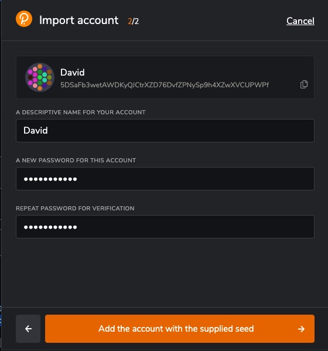
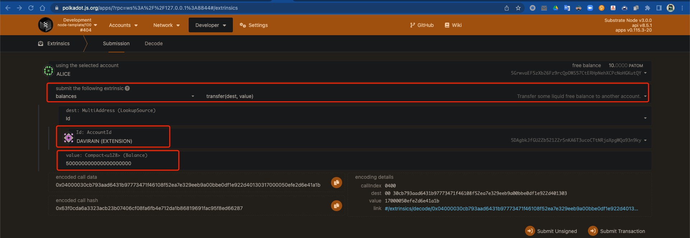
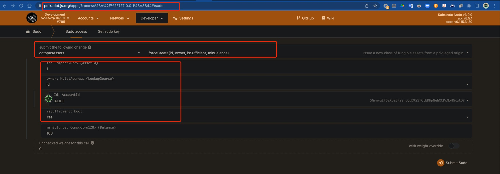
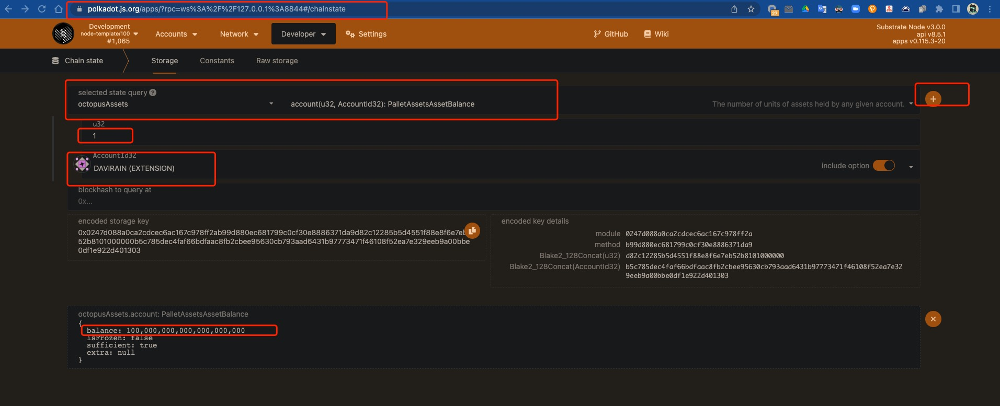
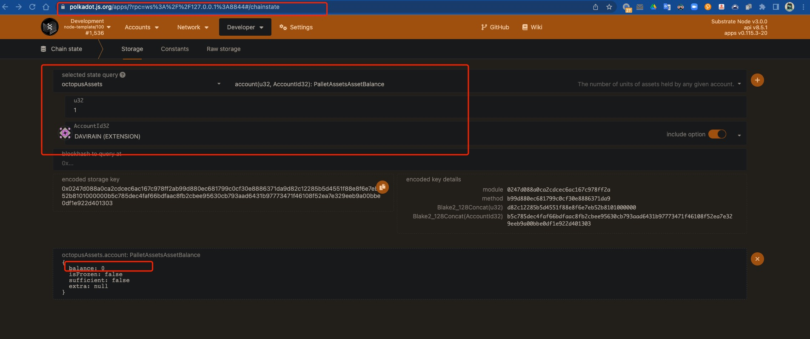

# 操作教程

## 预先准备安装

- Install [polkadot钱包插件](https://polkadot.js.org/extension/)
- 导入测试账户 : David 和 Davirain
  - 创建账户
  ```bash
    gaiad keys add david --output json > david_seed.json
    gaiad keys add davidrain --output json > davidrain_seed.json
  ```
  - 测试账户的助记词 :
    - David   
    >ecology agent adjust admit raw castle rather travel asthma good say field away vote timber miss demand mandate rib print sport vault warfare thrive
    - Davirian   
    >lawn lunch neutral task waste pioneer grape setup stumble copy squirrel wasp language speed slam output blur three squeeze network awful spoon monkey spare  
  - 根据以下图示导入账户  
    
    
    
  
    
## 在本地启动两条有IBC功能的Substrate链

```bash
# in terminal 1: build and lanch a chain to be recognized as ibc-0 by the relayer
git clone -b feature/m4v4-hermes1.0 git@github.com:octopus-network/substrate.git ibc-0
cd ibc-0
git submodule update --init
git pull
rm bin/node-template/octopus-pallets/Cargo.toml
cargo build -p node-template 
./target/debug/node-template --dev --rpc-methods=unsafe --ws-external --enable-offchain-indexing true


# in terminal 2: build and lanch a chain to be recognized as ibc-1 by the relayer
git clone -b feature/m4v4-hermes1.0-ibc1 git@github.com:octopus-network/substrate.git ibc-1
cd ibc-1
git submodule update --init
git pull
rm bin/node-template/octopus-pallets/Cargo.toml
cargo build -p node-template
./target/debug/node-template --dev --rpc-methods=unsafe --ws-external --enable-offchain-indexing true --port 2033 --ws-port 8844

```
* (可选)通过polkadot.js浏览刚刚启动的Substrate链信息:   
    https://polkadot.js.org/apps/?rpc=ws%3A%2F%2F127.0.0.1%3A9944#/explorer  
    https://polkadot.js.org/apps/?rpc=ws%3A%2F%2F127.0.0.1%3A8844#/explorer

## Create channel between two substrate nodes
* 编译Relayer
```bash
# in terminal 4
git clone --branch feature/m4v4-hermes1.0 git@github.com:octopus-network/hermes.git ibc-rs
cd ibc-rs
cargo build
```
* 将Substrate账户密钥导入Relayer
```bash
# in terminal 4
./target/debug/hermes -c  config.toml keys add -n david -f david_seed.json ibc-0
./target/debug/hermes -c  config.toml keys add -n davirain -f davirain_seed.json ibc-1

```
* 创建通道
```bash
# in terminal 4
RUST_BACKTRACE=full  
./target/debug/hermes -c config.toml  create channel --port-a transfer --port-b transfer ibc-0 -c ibc-1 -o unordered --new-client-connection 

# start the relayer
./target/debug/hermes -c config.toml start  

```

## 为测试账户充值
- 向ibc-0的David转帐
  1. 访问 ibc-0 的 extrinsics 模块  
  > https://polkadot.js.org/apps/?rpc=ws%3A%2F%2F127.0.0.1%3A9944#/extrinsics
  2. Alice转 5000000000000000000 给 David 
  
  3. 查询ibc-0上的David的余额   
  > https://polkadot.js.org/apps/?rpc=ws%3A%2F%2F127.0.0.1%3A9944#/accounts
  

- 向ibc-1的Davidrain转帐
  1. 访问 ibc-1 的 extrinsics 模块  
  > https://polkadot.js.org/apps/?rpc=ws%3A%2F%2F127.0.0.1%3A8844#/extrinsics
  2. Alice转 5000000000000000000 给 Davidrain
  
  3. 查询ibc-1上的Davidrain的余额
  > https://polkadot.js.org/apps/?rpc=ws%3A%2F%2F127.0.0.1%3A8844#/accounts 

  

## 创建跨链资产 
> 为两条链分别创建跨链资产
> ibc-0 的原生资产是 OCT， ibc-1 的原生资产是 ATOM.

- 在ibc-0链上创建 ibc-1 的跨链资产ATOM  
  1. 访问 ibc-0 的 sudo 模块  
  > https://polkadot.js.org/apps/?rpc=ws%3A%2F%2F127.0.0.1%3A9944#/sudo   
  2. 创建资产

  
- 在ibc-1链上创建 ibc-0 的跨链资产OCT
  1. 访问 ibc-1 的 sudo 模块  
  > https://polkadot.js.org/apps/?rpc=ws%3A%2F%2F127.0.0.1%3A8844#/sudo 
  2. 创建资产


## 通过 CLI 转帐
- 从 ibc-0(david) 向 ibc-1(davirain) 转OCT
```bash
# in terminal 5
./target/debug/hermes -c config.toml tx raw ft-transfer ibc-1 ibc-0 transfer channel-0 100000000000000000000 -o 9999 -d OCT
```
- 通过 polkadot.js 查询跨链事件  
> https://polkadot.js.org/apps/?rpc=ws%3A%2F%2F127.0.0.1%3A9944#/explorer 
  

> https://polkadot.js.org/apps/?rpc=ws%3A%2F%2F127.0.0.1%3A8844#/explorer   
 
- 通过 polkadot.js 查询跨链转帐结果
> https://polkadot.js.org/apps/?rpc=ws%3A%2F%2F127.0.0.1%3A8844#/chainstate 

 

- 从 ibc-1(davirain) 向 ibc-0(david) 转OCT
```bash
# in terminal 5
./target/debug/hermes --config config.toml tx ft-transfer --receiver-chain ibc-0 --sender-chain ibc-1 --sender-port transfer --sender-channel channel-0 --amount 1000000000000000000 --denom transfer/channel-0/OCT
```
- 通过 polkadot.js 查询跨链转帐事件和结果

