# Operation Guide

* The video demo is the same as [the one in the previous milestone](https://www.youtube.com/watch?v=pKcrPYAhPto), except the individual MMR root update service is not needed, as it's already integrated into Hermes.

## Requirements

- Install [polkadot wallet extension](https://polkadot.js.org/extension/)
- Import test accounts : David and Davirain
  - create accounts
  ```bash
    ./target/debug/hermes -c config.toml keys add ibc-0 -f ./david_seed.json
    ./target/debug/hermes -c config.toml keys add ibc-1 -f ./davirain_seed.json
  ```

  - The mnemonic words for both accounts are here :
    - David   
    >ecology agent adjust admit raw castle rather travel asthma good say field away vote timber miss demand mandate rib print sport vault warfare thrive
    - Davirian   
    >lawn lunch neutral task waste pioneer grape setup stumble copy squirrel wasp language speed slam output blur three squeeze network awful spoon monkey spare  
  - The screenshots below shows how to import the accounts  
  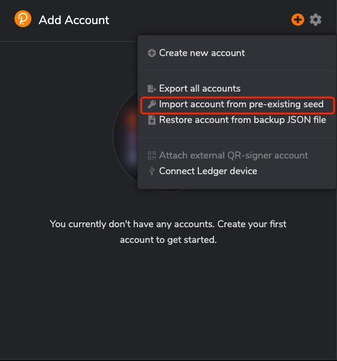  
  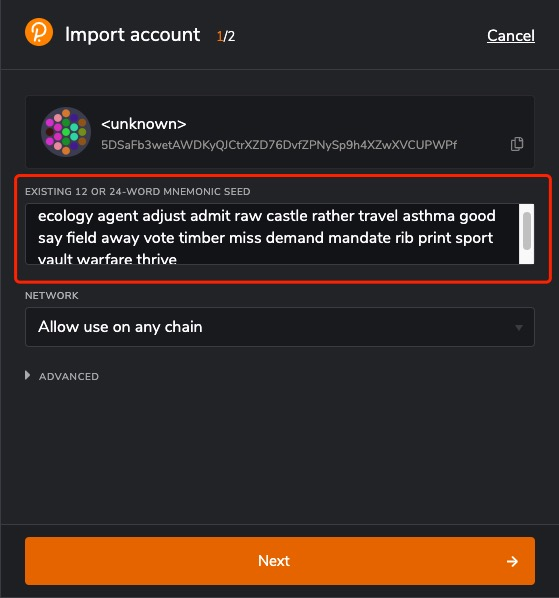  
  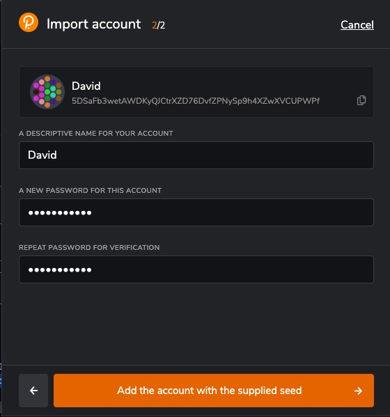  
  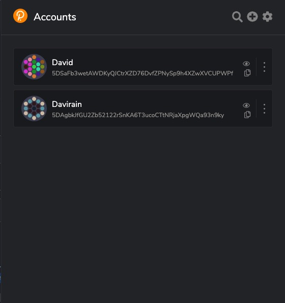  
  
- install rust
```bash
rustup default stable
rustup update
rustup update nightly
rustup target add wasm32-unknown-unknown --toolchain nightly
```
  
## Launch 2 IBC Enabled Substrate Chains Locally

```bash
# in terminal 1: build and lanch a chain to be recognized as ibc-0 by the relayer
git clone -b feature/m4-hermes1.0 git@github.com:octopus-network/substrate.git ibc-0
cd ibc-0
git submodule update --init
git pull
rm bin/node-template/octopus-pallets/Cargo.toml
rm -rf .ibc-*
cargo build -p node-template 
./target/debug/node-template --dev --rpc-methods=unsafe --ws-external --enable-offchain-indexing true


# in terminal 2: build and lanch a chain to be recognized as ibc-1 by the relayer
git clone -b feature/m4-hermes1.0-ibc-1 git@github.com:octopus-network/substrate.git  ibc-1
cd ibc-1
git submodule update --init
git pull
rm bin/node-template/octopus-pallets/Cargo.toml
rm -rf .ibc-*
cargo build -p node-template
./target/debug/node-template --dev --rpc-methods=unsafe --ws-external --enable-offchain-indexing true --port 2033 --ws-port 8844

```
* (Option)explore the chains info and events via polkadot.js:   
    https://polkadot.js.org/apps/?rpc=ws%3A%2F%2F127.0.0.1%3A9944#/explorer  
    https://polkadot.js.org/apps/?rpc=ws%3A%2F%2F127.0.0.1%3A8844#/explorer


## Create channel between two substrate nodes
* Build the Relayer
```bash
# in terminal 4
git clone --branch feature/m4-hermes1.0 git@github.com:octopus-network/hermes.git ibc-rs
cd ibc-rs
cargo build
```
* Add keys to the Relayer
```bash
# in terminal 4
./target/debug/hermes -c  config.toml keys add -n david -f david_seed.json ibc-0
./target/debug/hermes -c  config.toml keys add -n davirain -f davirain_seed.json ibc-1

```
* Create channel 
```bash
# in terminal 4
RUST_BACKTRACE=full  
./target/debug/hermes -c config.toml  create channel --port-a transfer --port-b transfer ibc-0 -c ibc-1 -o unordered --new-client-connection 

# start the relayer
./target/debug/hermes -c config.toml start  
```

## Top-up for test account
- Deposit a certain amount of assets to the David account on ibc-0
  1. access ibc-0 extrinsics module via polkadot.js  
  > https://polkadot.js.org/apps/?rpc=ws%3A%2F%2F127.0.0.1%3A9944#/extrinsics
  2. transfer 500000000000000000000 to David from Alice
  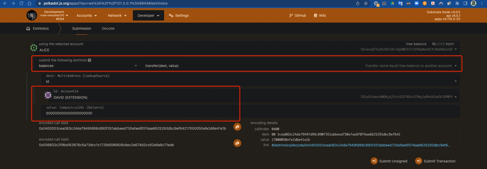
  3. query the balance of David on ibc-0  
  > https://polkadot.js.org/apps/?rpc=ws%3A%2F%2F127.0.0.1%3A9944#/accounts
  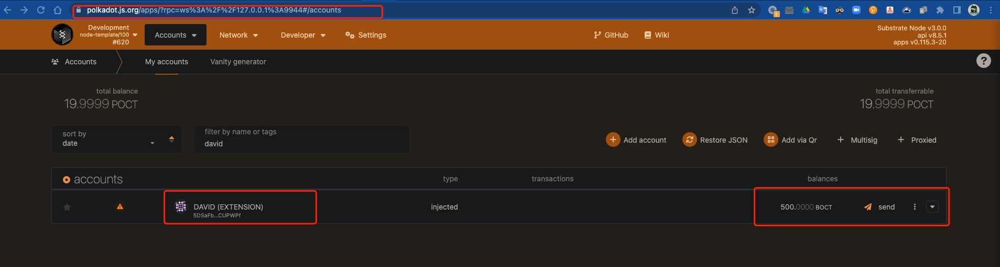

- Deposit a certain amount of assets to the Davirian account on ibc-1
  1. access ibc-1 extrinsics module via polkadot.js  
  > https://polkadot.js.org/apps/?rpc=ws%3A%2F%2F127.0.0.1%3A8844#/extrinsics
  2. transfer 500000000000000000000 to Davirian from Alice
  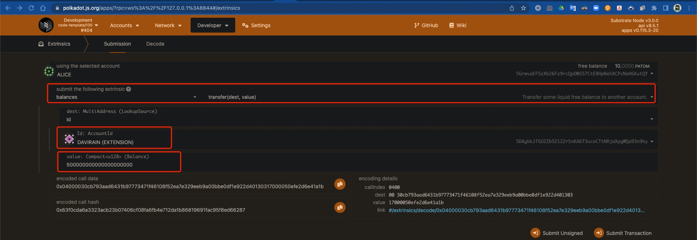
  3. query the balance of Davirian on ibc-1
  > https://polkadot.js.org/apps/?rpc=ws%3A%2F%2F127.0.0.1%3A8844#/accounts 

  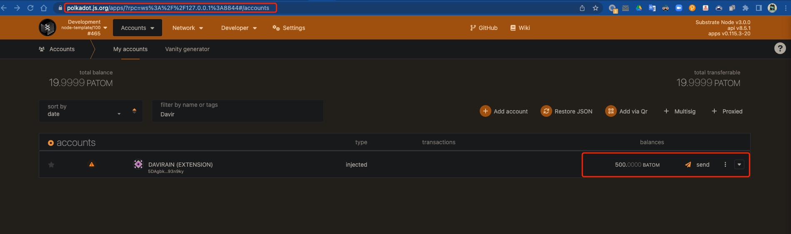

## Create cross-chain assets 
>In order to identify assets for cross-chain transfers, we need to create each other's asset classes on the target chain separately
> Current,ibc-0 native token is OCT and ibc-1 native token is ATOM.

- Create assets ATOM on ibc-0 chain for ibc-1 chain  
  1. access ibc-0 sudo module via polkadot.js  
  > https://polkadot.js.org/apps/?rpc=ws%3A%2F%2F127.0.0.1%3A9944#/sudo   
  2. create asset class
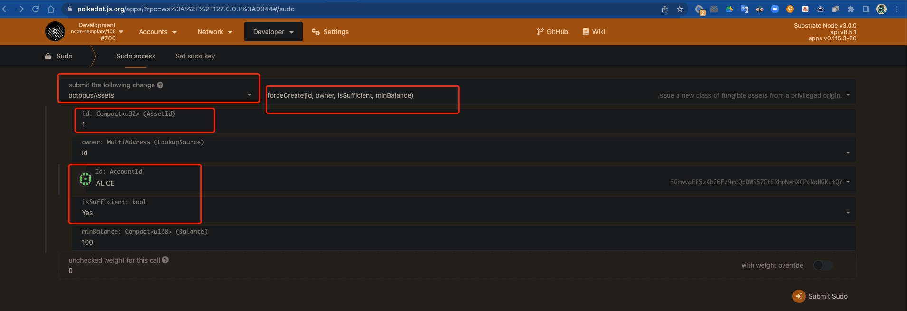
  
- Create assets OCT on ibc-1 chain for ibc-0 chain
  1. access ibc-0 sudo module via polkadot.js  
  > https://polkadot.js.org/apps/?rpc=ws%3A%2F%2F127.0.0.1%3A8844#/sudo 
  2. create asset class
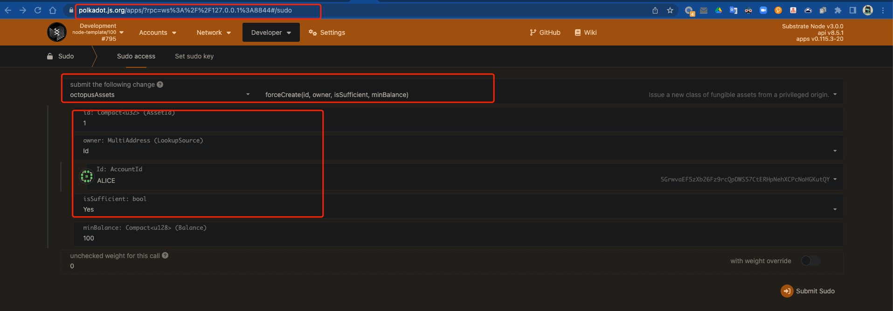

## Transfer fungible tokens by CLI
- Transfer OCT from ibc-0(david) to ibc-1(davirain)
```bash
# in terminal 5
./target/debug/hermes -c config.toml tx raw ft-transfer ibc-1 ibc-0 transfer channel-0 100000000000000000000 -o 9999 -d OCT
```
- query the transfer events via polkadot.js  
> https://polkadot.js.org/apps/?rpc=ws%3A%2F%2F127.0.0.1%3A9944#/explorer 
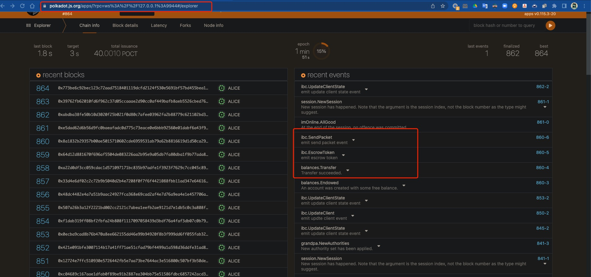  

> https://polkadot.js.org/apps/?rpc=ws%3A%2F%2F127.0.0.1%3A8844#/explorer   
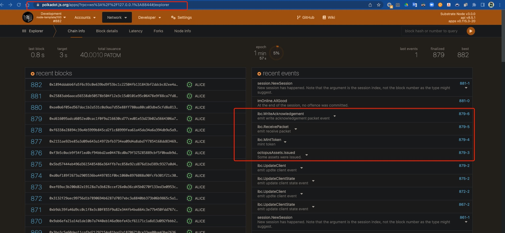 
- query the transfer result via polkadot.js
> https://polkadot.js.org/apps/?rpc=ws%3A%2F%2F127.0.0.1%3A8844#/chainstate 

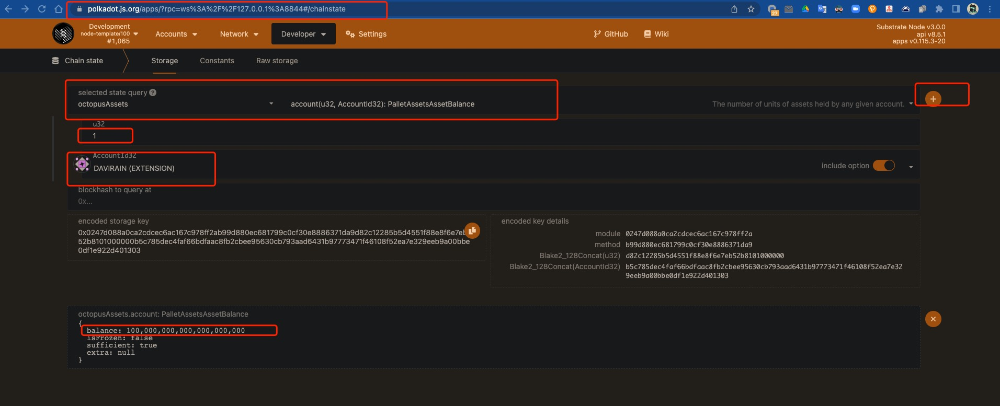 

- Get denom trace hash  
```bash
# in terminal 6
cd octopusxt 
cargo run -- denom-trace transfer channel-0 OCT
# output like: ibc/93B4B75C6D876BD9168CB4FA8B78D3D9C916FD3100EAF8A6AD3B3093661E8B9E
```

- Transfer OCT back to ibc-0(david) from ibc-1(davirain)
```bash
# in terminal 5
./target/debug/hermes -c config.toml tx raw ft-transfer ibc-0 ibc-1 transfer channel-0 100000000000000000000 -o 9999 -d ibc/93B4B75C6D876BD9168CB4FA8B78D3D9C916FD3100EAF8A6AD3B3093661E8B9E
```
- query the transfer events and result via polkadot.js
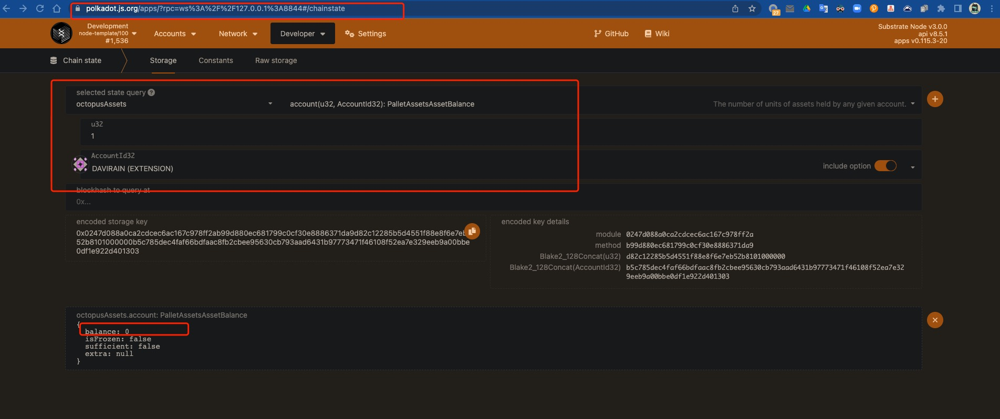
