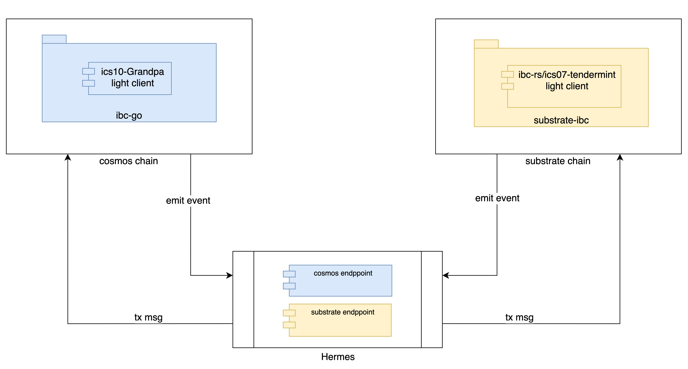

# Substrate-IBC Contract 2 Milestone 3 Deliverable

## This milestone includes the following goals

* ICS 018 Relayer Algorithms (Cosmos-SDK cross-testing)  
  Successful integration test with a workable ICS10 Grandpa light client that support BEEFY feature, capable of relaying IBC packets between one Grandpa Substrate chain and one Cosmos SDK Tendermint chain

## Architecture & High Level  

  

* Substrate chain integrated substrate-ibc  
Substrate-ibc is built on top of ibc-rs, and the substrate chain with integrated subtrate-ibc component has the ability to interact with other chain that integtrated ibc compoment.
Currently, substrate-ibc has implemented most of the IBC TAO and IBC ICS20 related Specs.

* Cosmos chain integrated ibc-go  
The Octopus Network has implemented the ics10 grandpa light client prototype in ibc-go, the cosmos chain that integrated of this version of the ibc-go can interact with the substrate chain that intetrated substrate-ibc.  
The ics10 grandpa light client relies on the substrate beefy feature to complete the verification, please refer to [here](https://github.com/paritytech/grandpa-bridge-gadget/blob/master/docs/beefy.md) for beefy
* Hermes relayer  
In order to implement cross-chain interaction between cosmos chain and substrate chain, we have added support for substrate in hermes.

## Related Repos  

| Repo Name | Branch | Note |
| --- | --- | --- |
| Hermes | [icf-m3](https://github.com/octopus-network/hermes/tree/icf-m3) | IBC relayer |
|  |  |  |
| substrate-ibc | [icf-m3](https://github.com/octopus-network/substrate-ibc/tree/icf-m3) | based on ibc-rs  |
| polkadot | [icf-m3](https://github.com/octopus-network/polkadot/tree/icf-m3) | demo chain |
|  |  |  |
| ibc-go | [icf-m3](https://github.com/octopus-network/ibc-go/tree/icf-m3) | include ics10 grandpa light client |
| oct-planet | [icf-m3](https://github.com/octopus-network/oct-planet/tree/icf-m3) | demo chain |
|  |  |  |

## Demo presentation
For a demonstration of cross-chain interaction between cosmos chain and substrate chain, please refer [here](./guide.md)

## Issues  

This milestone mainly verifies (POC) the cross-chain interaction between cosmos and substrate based on the ibc protocol, and due to the differences between cosmos sdk and substrate sdk, the following issues remain to be solved:

* substrate-ibc  
    unimpl Context::host_consensus_state and Context::pending_host_consensus_state
* ibc-go ics10 light client  
    unsupport ics10 upgrade and misbehaviour

We will focus on the above issues in the next phase, please be informed!
