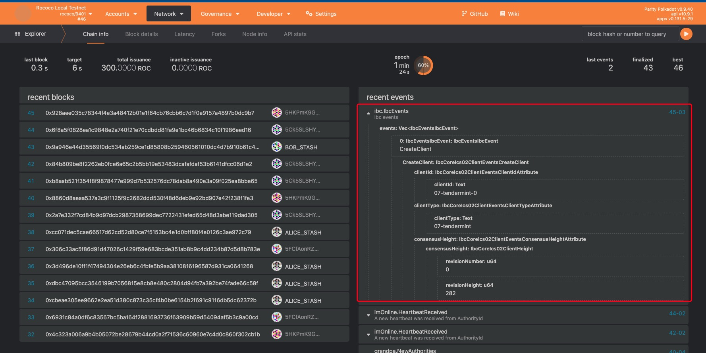
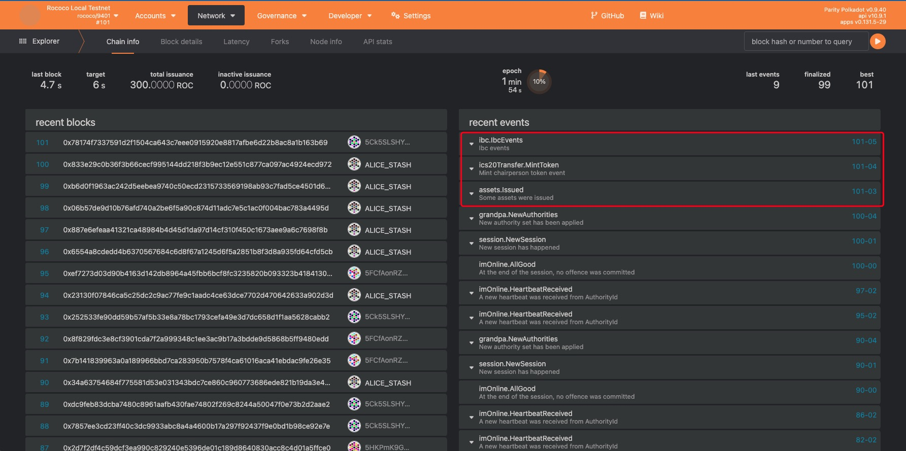
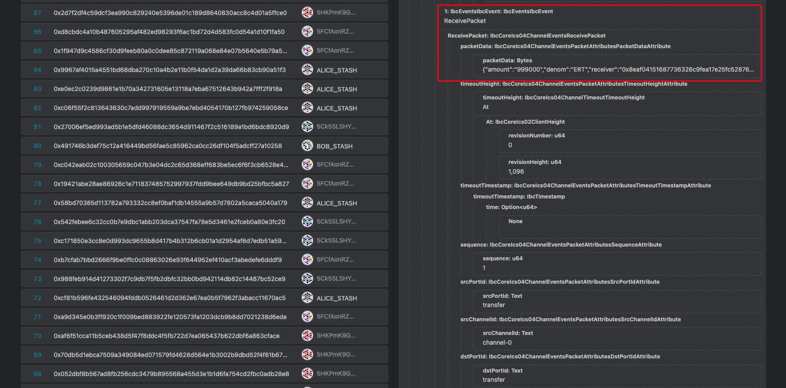
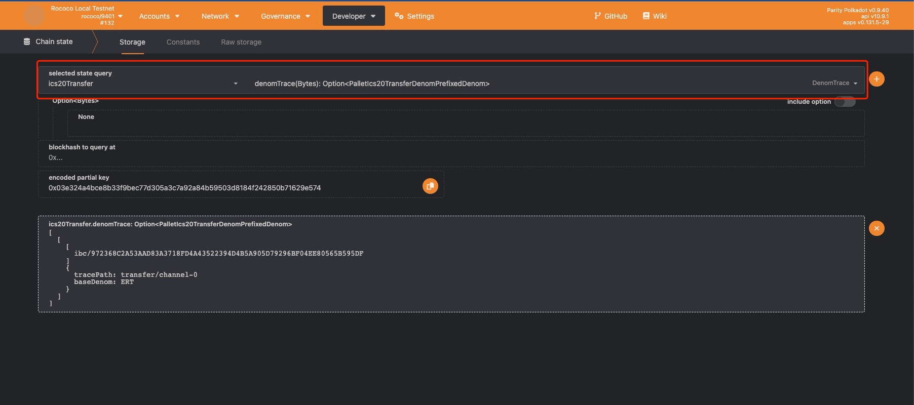
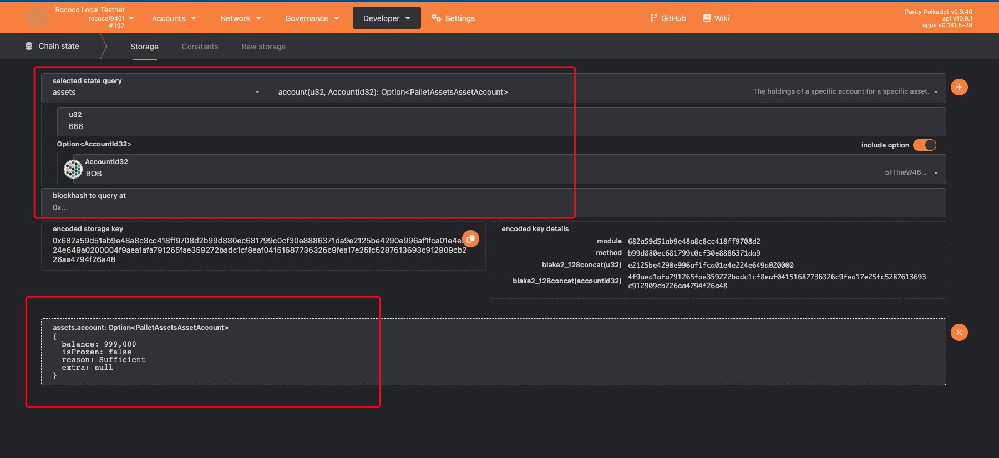

# Operation Guide

## Pre-requisites

* rust 1.69 +

* go 1.18 +

* python 3.10 +

* [zombienet 1.3.23](https://github.com/paritytech/zombienet/releases/tag/v1.3.23)

* [ignite 0.26.1](https://github.com/ignite/cli/releases/tag/v0.26.1)

## Spin up substrate chain

```bash
# open terminal 1 
# clone substrate demo chain
git clone https://github.com/octopus-network/polkadot

cd polkadot

git checkout icf-m3

# build polkadot 
cargo build --release --bin polkadot

# optional put polkadot cli into your BIN PATH
# open zombienet_tests/ibc/rococo.toml and change the polkadot cli location
# default_command = "your polkadot cli location "

# spin up polkadot nodes
zombienet spawn zombienet_tests/ibc/rococo.toml

```

## Spin up cosmos chain

```bash
# open terminal 2 
# clone cosmos demon chain
git clone https://github.com/octopus-network/oct-planet.git

cd oct-planet

git checkout icf-m3

# launch a cosmos chain: earth 
ignite chain serve -f -v -c earth.yml

```

## Compile and config hermes

```bash
# open terminal 3
$ git clone https://github.com/octopus-network/hermes.git

$ cd hermes

$ git checkout icf-m3

# build
$ cargo build -p ibc-relayer-cli
# check hermes version
$ ./target/debug/hermes version

# optional,export PATH
# export PATH="$PWD/./target/release/:$PATH"

# add key for hermes relayer
hermes --config config/cos_sub.toml keys add --chain earth-0 --key-file config/alice_cosmos_key.json --key-name alice
hermes --config config/cos_sub.toml keys add --chain rococo-0 --key-file config/bob_substrate_key.json --key-name Bob

```

## Test

```bash
# back to terminal 3
# create channel
#cd hermes
hermes --config config/cos_sub.toml create channel --a-chain earth-0 --b-chain rococo-0 --a-port transfer --b-port transfer --new-client-connection --yes

# start hermes service 
hermes --config config/cos_sub.toml start

# open terminal 4
# create cross asset on substrate
# first install the sub-cli dependency library: substrate-interface
pip install substrate-interface

./scripts/sub-cli --sudo //Alice tx --signer //Alice --module Assets --method force_create --params '{"id":666,"owner":"5FHneW46xGXgs5mUiveU4sbTyGBzmstUspZC92UhjJM694ty","is_sufficient":true,"min_balance": 10}'

# transfer from cosmos chain(earth-0) to substrate chain(rococo)
hermes --config config/cos_sub.toml tx ft-transfer --timeout-height-offset 1000 --number-msgs 1 --dst-chain rococo-0 --src-chain earth-0 --src-port transfer --src-channel channel-0 --amount 999000 --denom ERT

# Wait for hermes to complete the relay,about 30s~60s

# query substrate account(Bob) change
./scripts/sub-cli query-balances --account 5FHneW46xGXgs5mUiveU4sbTyGBzmstUspZC92UhjJM694ty
# The output is as follows:
account: 5FHneW46xGXgs5mUiveU4sbTyGBzmstUspZC92UhjJM694ty
balances:
- amount: 98747699999976666669
  denom: ROC
- amount: 999000
  denom: ERT
  trace_path: transfer/channel-0
  denom_trace_hash: ibc/972368C2A53AAD83A3718FD4A43522394D4B5A905D79296BF04EE80565B595DF

# open terminal 5
# cd your oct-planet location
# query cosmos account(Alice) change 
earth --node tcp://localhost:26657 query bank balances $(earth --home .earth keys --keyring-backend="test" show alice -a)
# The output is as follows:
balances:
- amount: "199001000"
  denom: ERT
- amount: "99988965"
  denom: stake
pagination:
  next_key: null
  total: "0"

# back to terminal 4
# transfer back to earth from rococo
hermes --config config/cos_sub.toml tx ft-transfer --timeout-height-offset 1000 --denom ibc/972368C2A53AAD83A3718FD4A43522394D4B5A905D79296BF04EE80565B595DF --dst-chain earth-0 --src-chain rococo-0 --src-port transfer --src-channel channel-0 --amount 999000

# Wait for hermes to complete the relay,about 30s~60s

# query substrate account(Bob) change
./scripts/sub-cli query-balances --account 5FHneW46xGXgs5mUiveU4sbTyGBzmstUspZC92UhjJM694ty
# The output is as follows:
account: 5FHneW46xGXgs5mUiveU4sbTyGBzmstUspZC92UhjJM694ty
balances:
- amount: 98710499999973333336
  denom: ROC

# back to terminal 5
# cd your oct-planet
# query cosmos account(Alice) change 
earth --node tcp://localhost:26657 query bank balances $(earth --home .earth keys --keyring-backend="test" show alice -a)
# The output is as follows:
balances:
- amount: "200000000"
  denom: ERT
- amount: "99987078"
  denom: stake
pagination:
  next_key: null
  total: "0"

```
We have also provided a simple script to test the ics20 transfer function  
location: `your hermes dir/scripts/transfer`  

```bash

#!/bin/bash -e

# transfer from rococo to earth
hermes --config config/cos_sub.toml tx ft-transfer --timeout-height-offset 1000  --number-msgs 1 --dst-chain earth-0 --src-chain rococo-0 --src-port transfer --src-channel channel-0 --amount 20000000000000000 --denom ROC

sleep 45

# transfer back to rococo from earth
hermes --config config/cos_sub.toml tx ft-transfer --timeout-height-offset 1000 --denom ibc/B94E95895D5F53F95DDE1A02663268D7288B39172F7DBA4D4A48FF4DDA4E092A  --dst-chain rococo-0 --src-chain earth-0 --src-port transfer --src-channel channel-0 --amount 20000000000000000

sleep 45

# transfer from earth to rococo
hermes --config config/cos_sub.toml tx ft-transfer --timeout-height-offset 1000 --number-msgs 1 --dst-chain rococo-0 --src-chain earth-0 --src-port transfer --src-channel channel-0 --amount 999000 --denom ERT

sleep 45

# transfer back to earth from rococo
hermes --config config/cos_sub.toml tx ft-transfer --timeout-height-offset 1000 --denom ibc/972368C2A53AAD83A3718FD4A43522394D4B5A905D79296BF04EE80565B595DF  --dst-chain earth-0 --src-chain rococo-0 --src-port transfer --src-channel channel-0 --amount 999000


```

## Optional,explore the substrate chain info via polkadot.js  

* browser ibc events: <https://polkadot.js.org/apps/?rpc=ws%3A%2F%2F127.0.0.1%3A9944#/explorer>  
create client event  

ics20 transfer event  



* Query ics20 cross asset: <https://polkadot.js.org/apps/?rpc=ws%3A%2F%2F127.0.0.1%3A9944#/chainstate>  
denom trace  

ics20 cross asset  

