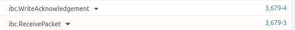

# Substrate-IBC Milestone 2 Deliverable

This milestone includes a runnable Substrate chain integrated with the following modules in [ibc-rs](https://github.com/informalsystems/ibc-rs),  
* ICS002 Client Semantics
* ICS003 Connection Semantics
* ICS004 Channel and Packet Semantics
* ICS023 Vector Commitments 
* ICS024 Host Requirements

| Number | Deliverable       | Commnets                                                |
| ------ | ----------------- | ------------------------------------------------------------ |
| 1.     | Substrate chain  |     [repo](https://github.com/octopus-network/substrate/tree/feature/beefy)   |
| 2.     | Relayer |   [repo](https://github.com/octopus-network/ibc-rs/tree/feature/beefy)   |
| 3.     | Substrate-Ibc Pallet | [repo](https://github.com/octopus-network/substrate-ibc) |
| 4.     | Design Spec       |  [Design](./design.md)                                                            |
| 5.     | Operation Guide, including testing script       |  Right below                                                            |
| 6.     | Vedio Demo           | [Vedio](https://www.youtube.com/watch?v=MLdwqpAu_ZA) |

# Operation Guide
## Launch 2 IBC Enabled Substrate Chains Locally
```bash
git clone https://github.com/octopus-network/substrate/tree/feature/beefy
cd substrate
rm -rf .ibc-*
cargo build -p node-template

# in terminal 1: lanch a chain to be recognized as ibc-0 by the relayer
./target/debug/node-template --dev -d .ibc-0 --rpc-methods=unsafe --ws-external --enable-offchain-indexing true

# in terminal 2: lanch a chain to be recognized as ibc-1 by the relayer
 ./target/debug/node-template --dev -d .ibc-1 --rpc-methods=unsafe --ws-external --enable-offchain-indexing true --port 2033 --ws-port 8844
```

## Prepare the Relayer and Run E2E Test
### Requirement
* python3.8+
* `pip install toml`

### Compile the Relayer
```bash
git clone https://github.com/octopus-network/ibc-rs/tree/feature/beefy
cd ibc-rs
cargo build
```

### Run e2e Test
```bash
cd e2e-ibc-m2
python run.py -c ../config.toml --cmd ../target/debug/hermes # Run automatic e2e testing
view README.md  # More details of the testing 
```

After the packet transfer completes, events below will be detected by polkadot.js in sequence and display on the frontend(e.g., https://polkadot.js.org/apps/?rpc=ws%3A%2F%2F127.0.0.1%3A9944#/explorer). Whereas `SendPacket` & `AcknowledgementPacket` envets are emitted from the chain initiated the packet transfer, and `WriteAcknowledgement` & `ReceivePacket` are from the other chain. It takes over 20 mins.





## Commands in [Vedio Demo](https://www.youtube.com/watch?v=MLdwqpAu_ZA)
```bash
# in terminal 1: lanch a chain to be recognized as ibc-0 by the relayer
./target/debug/node-template --dev -d .ibc-0 --rpc-methods=unsafe --ws-external --enable-offchain-indexing true

# in terminal 2: lanch a chain to be recognized as ibc-1 by the relayer
 ./target/debug/node-template --dev -d .ibc-1 --rpc-methods=unsafe --ws-external --enable-offchain-indexing true --port 2033 --ws-port 8844

# in terminal 3: establish IBC clients, connections, and channels
 RUST_BACKTRACE=full  ./target/debug/hermes -c  config.toml create channel ibc-0 ibc-1 --port-a transfer --port-b transfer -o unordered

# in terminal 4: start a relayer
RUST_BACKTRACE=full ./target/debug/hermes -c config.toml start

# in terminal 3: trigger packet transfer
./target/debug/hermes -c config.toml tx raw ft-transfer ibc-1 ibc-0 transfer channel-0 9999 -o 9999 -n 1 -t 9999
```


# Pending Issues
## Relevant Issues in Github
* [Client update based on Beefy protocol](https://github.com/informalsystems/ibc-rs/issues/1775)
* [new variant needed in the enum of commitment_proof](https://github.com/informalsystems/ibc-rs/issues/1945)
* [height.increment() not needed for Beefy](https://github.com/informalsystems/ibc-rs/issues/1845)
* [Allow Timeout UNORDERED channel without proof of absence](https://github.com/cosmos/ibc/issues/620): Some chains do not have ability to provide proof of absence, like Substrate based chains. Therefore, the proof of [timeout](Some chains do not have ability to provide proof of absence) is pending in code [here](https://github.com/octopus-network/ibc-rs/blob/6e5f6c196dad0acde4aafb379b39bd01ba5a0724/relayer/src/chain/substrate.rs#L1518) and [here](https://github.com/octopus-network/ibc-rs/blob/6e5f6c196dad0acde4aafb379b39bd01ba5a0724/relayer/src/chain/substrate.rs#L1521).
* [commitment_proof for non-Cosmos chain](https://github.com/confio/ics23/issues/80)

## Other Issues
* Slow process: It takes about 15 min to establish IBC client, connection, and channel to link the 2 chains, and about 10 min to complete a packet transfer.