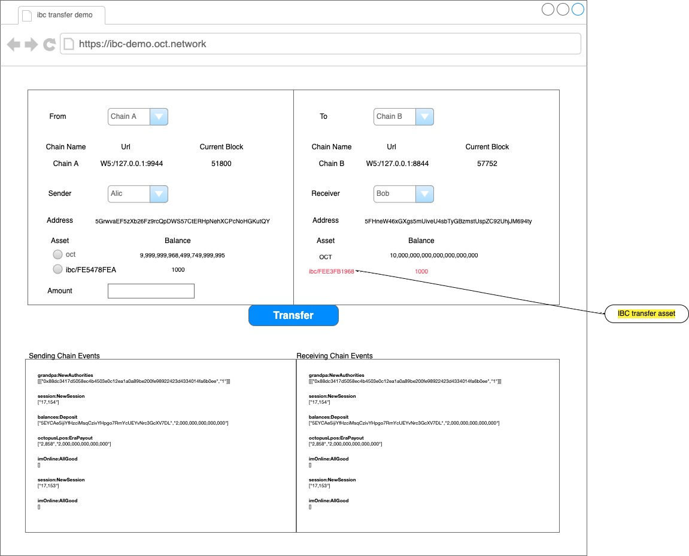
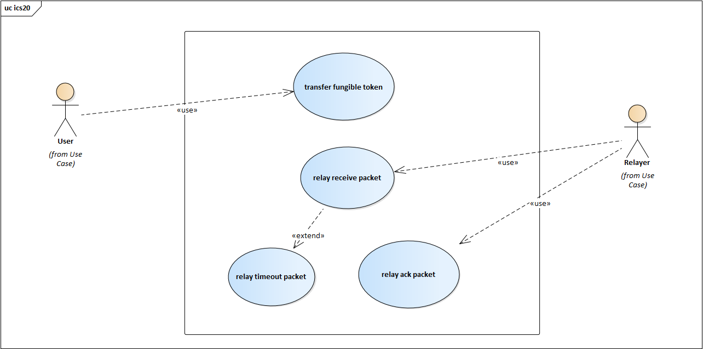
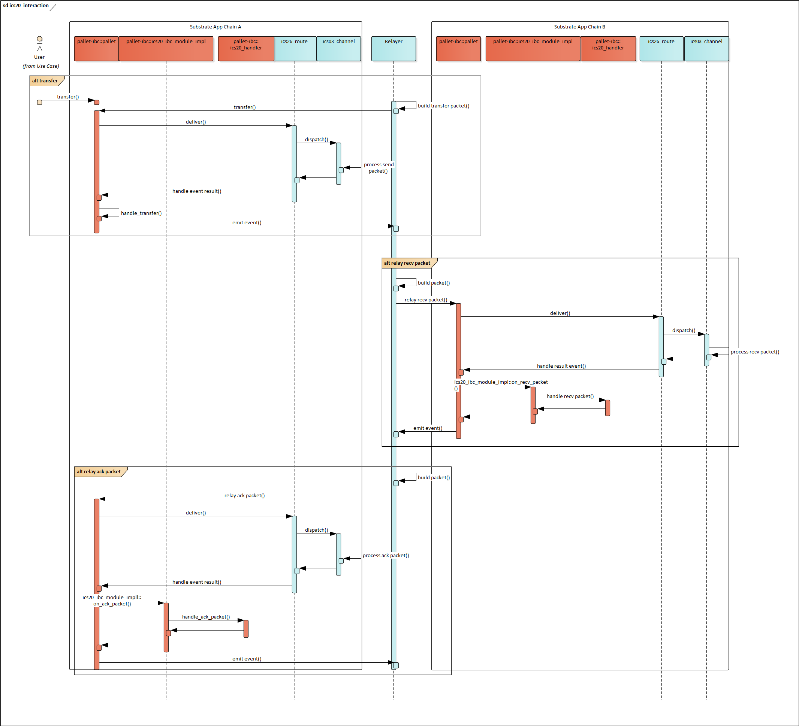
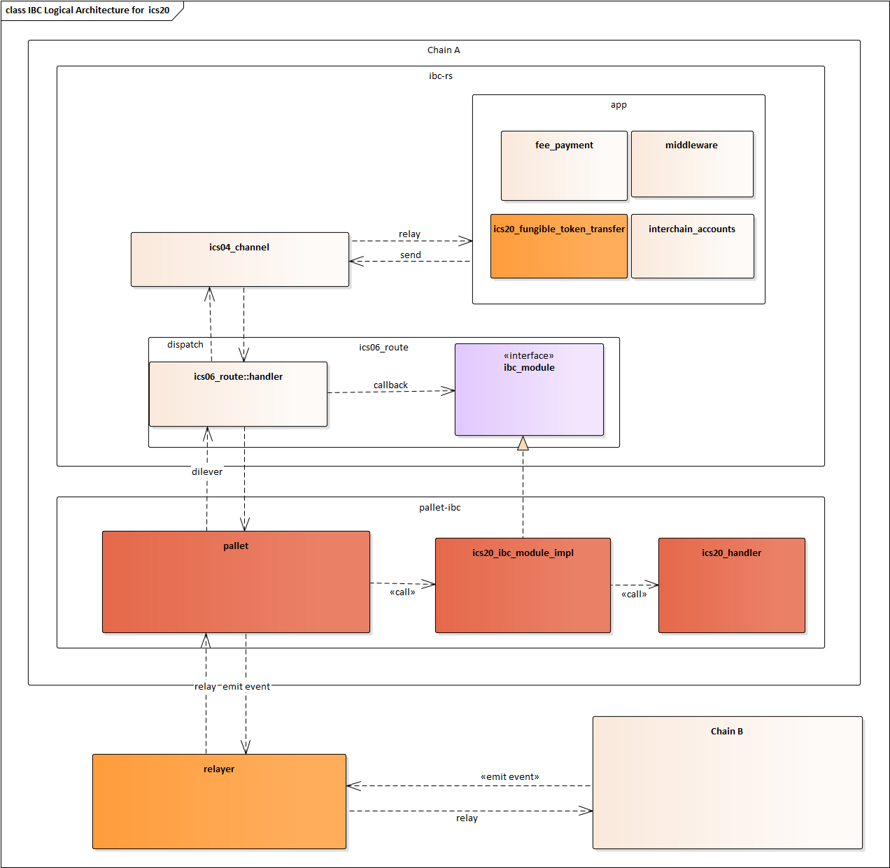
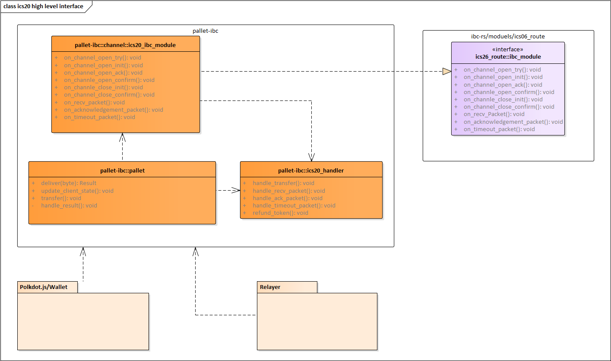
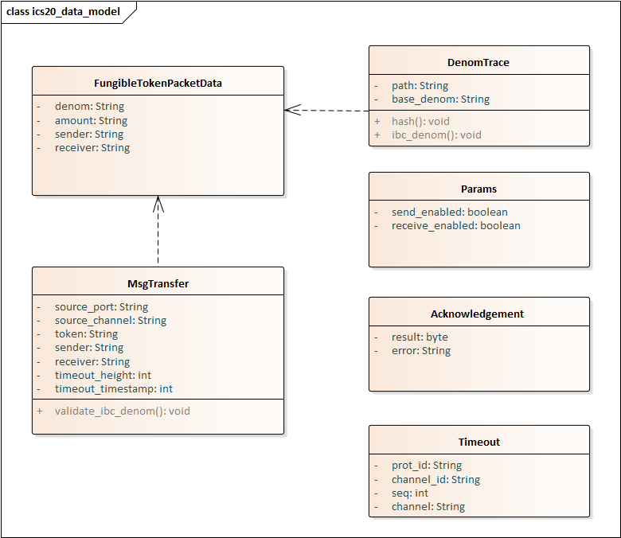

# Overview  
  This document describes the reference implementation of the ics20 spec in pallet-ibc and ibc-rs.

## Requirments
* Testnet involving two IBC-enabled Substrate chains capable of transferring a token following ICS 020
* UI and Cli supporting the testnet   
   

## Use Cases     
   

* transfer fungible token：send ICS-20 fungible token transfer packets

* relay receive packet：relay the packets sent but not yet received，if the sent packets have timed out then a timeout packet is sent to the source chain.

* relay ack packet：relay acknowledgments to the original source of the packets.

## Architecture & High Level

### System Interaction
  

### Architecture
  

### Interface

### Data Model
