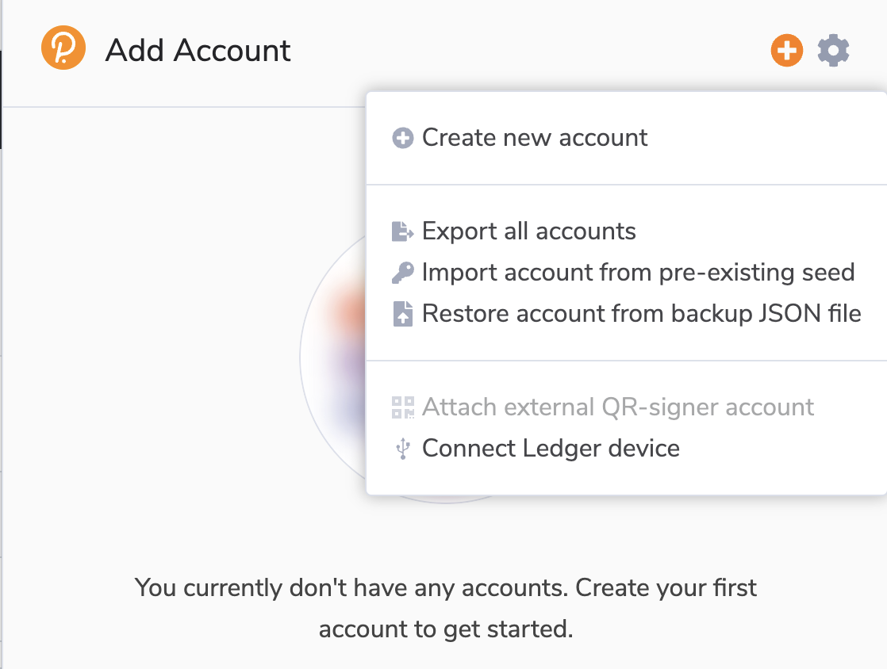
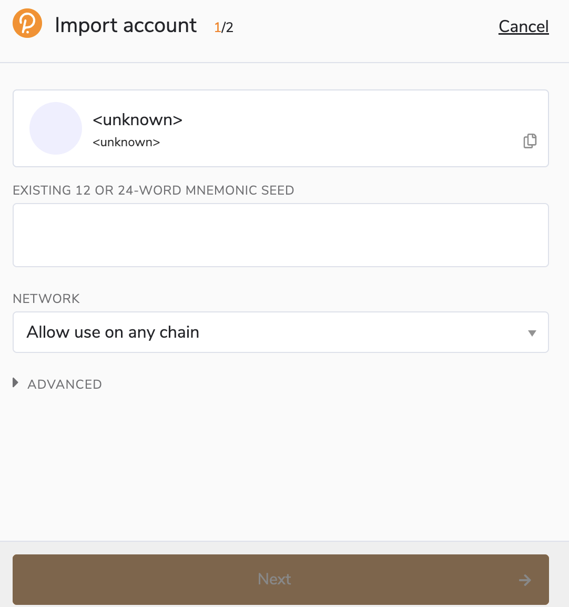
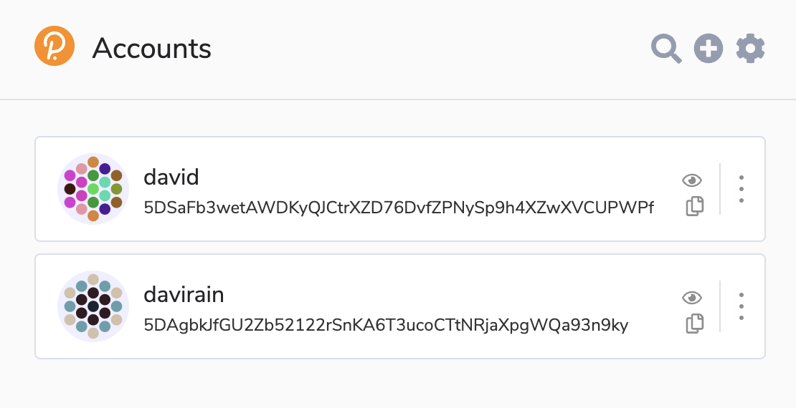
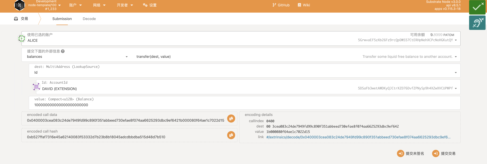

# Operation Guide

## Requirements

- Install [polkadot valut extension](https://polkadot.js.org/extension/)
- Import test accounts : David and Davirain
  - The mnemonic words for both accounts are here :
    - [David](https://github.com/octopus-network/ibc-rs/blob/feature/ics20/david_seed.json)
    - [Davirian](https://github.com/octopus-network/ibc-rs/blob/feature/ics20/davirain_seed.json)
  - The screenshots below shows how to import the accounts  




## Transfer tokens by CLI

* Launch 2 IBC Enabled Substrate Chains Locally
```bash
git clone --branch feature/ics20-ibc-0 https://github.com/octopus-network/substrate.git ibc-0
git clone --branch feature/ics20-ibc-1 https://github.com/octopus-network/substrate.git ibc-1

cd ibc-0
git submodule update --init
git pull
rm bin/node-template/octopus-pallets/Cargo.toml
rm -rf .ibc-*

cd ibc-1
git submodule update --init
git pull
rm bin/node-template/octopus-pallets/Cargo.toml
rm -rf .ibc-*

# in terminal 1: build and lanch a chain to be recognized as ibc-0 by the relayer
cd ibc-0
cargo build -p node-template 
./target/debug/node-template --dev -d .ibc-0 --rpc-methods=unsafe --ws-external --enable-offchain-indexing true --port 2033 --ws-port 8844

# in terminal 2: build and lanch a chain to be recognized as ibc-1 by the relayer
cd ibc-1
cargo build -p node-template
./target/debug/node-template --dev -d .ibc-1 --rpc-methods=unsafe --ws-external --enable-offchain-indexing true 


```
* (Option)explore the chains info and events via polkadot.js:   
    https://polkadot.js.org/apps/?rpc=ws%3A%2F%2F127.0.0.1%3A9944#/explorer  
    https://polkadot.js.org/apps/?rpc=ws%3A%2F%2F127.0.0.1%3A8844#/explorer


* Start mmr root update service
```bash
git clone --branch feature/v0.9.13 https://github.com/octopus-network/octopusxt.git
# in terminal 3: start mmr root update serivce
cd octopusxt
cargo test test_update_client_state_service -- --nocapture 
```

* Build the Relayer
```bash
# in terminal 4
git clone --branch feature/ics20 https://github.com/octopus-network/ibc-rs.git
cd ibc-rs
cargo build
# check version
./target/debug/hermes -c  config.toml --version
```


* Create channel between two substrate nodes
```bash
# in terminal 4
RUST_BACKTRACE=full  
./target/debug/hermes -c config.toml  create channel --port-a transfer --port-b transfer ibc-0 -c ibc-1 -o unordered --new-client-connection 

RUST_BACKTRACE=full 
./target/debug/hermes -c  -c config.toml start  

```

* Transfer fungible tokens requirements

> When doing ibc transfers you need to first allocate certain assets to the david account on the ibc-0 chain, which already needs to be pre-instantiated on both chains, to transfer assets across the chain. Here are the assets #1, respectively the cross-chain asset OCT on ibc-0 and the other is the cross-chain asset ATOM on ibc-1. Here the native token on ibc-0 is ATOM and ibc-1 is OCT.

- Pre-transfer a certain amount of assets to the david account on ibc-0



- Instantiate cross-chain assets on two chains

this is one chain snap


* Transfer fungible tokens
```bash
# in terminal 5
# transfer fungible tokens from ibc-0 to ibc-1
./target/debug/hermes -c config.toml tx raw ft-transfer ibc-1 ibc-0 transfer channel-0 100000000000000000000 -o 9999 -d ATOM

# get hash denom
cd octopusxt 
cargo run -- denom-trace transfer channel-0 ATOM

# transfer fungible tokens from ibc-1 back to ibc-0
./target/debug/hermes -c config.toml tx raw ft-transfer ibc-0 ibc-1 transfer channel-0 100000000000000000000 -o 9999 -d ibc/04C1A8B4EC211C89630916F8424F16DC9611148A5F300C122464CE8E996AABD0
```

transfer ATOM tokens from ibc-0(david) to ibc-1(davirain),
this is result ibc-1 davirain receive ATOM token from ibc-0 david.


transfer `ibc/04C1A8B4EC211C89630916F8424F16DC9611148A5F300C122464CE8E996AABD0` tokens from ibc-1(davirain) back to ibc-0(david),
this result ibc-0 davirain burun ATOM token


this result ibc-0 will unescorw token from escown account


## Transfer fungible tokens by UI
* Install UI demo
```bash
# in terminal 6: start UI demo
git clone git@github.com:octopus-network/ibc-frontend-demo.git
cd substrate-front-end-template
# install dependencies
yarn install
# start service
yarn start
```
* Open your browser and visit http://localhost:8000/
* Transfer tokens by web front end


## Video Demo
* Pls refer to [Youtube]()
## Issues
  N/A
