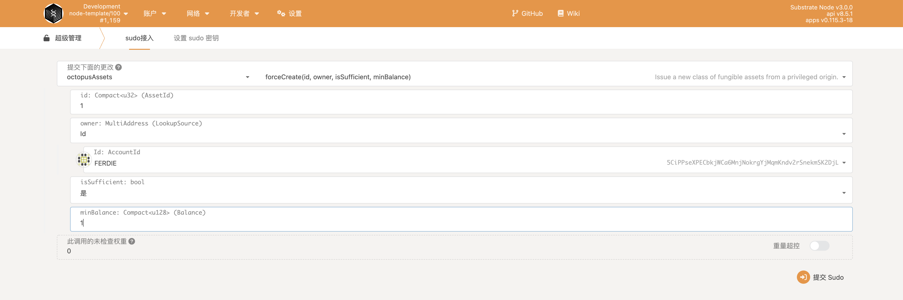
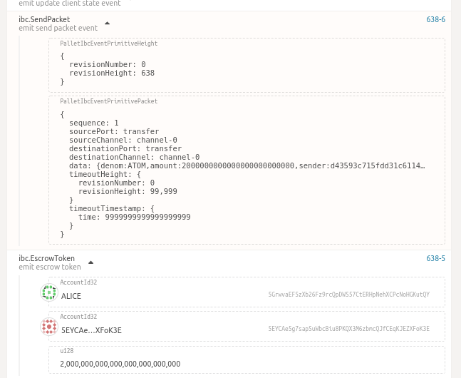
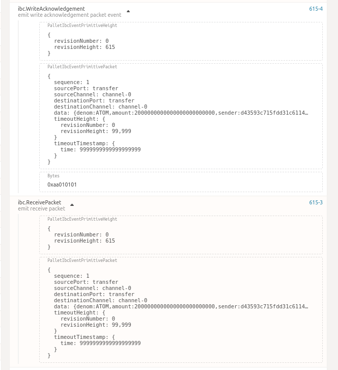
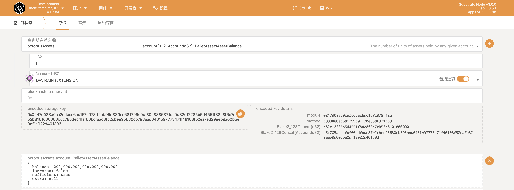
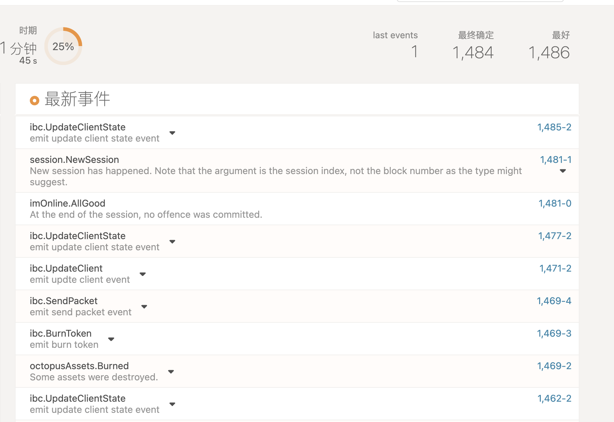
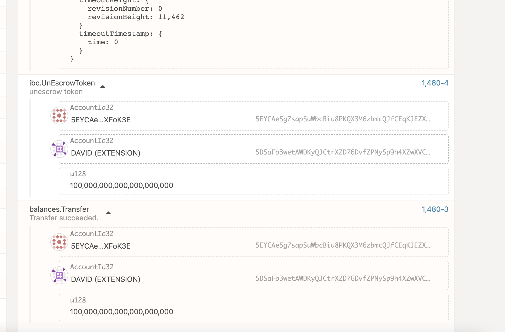

# Operation Guide

## Transfer tokens by CLI

* Launch 2 IBC Enabled Substrate Chains Locally in terminal 1/2
```bash
git clone --branch feature/ics20-ibc-0 https://github.com/octopus-network/substrate.git substrate-oct

cd substrate-oct
git submodule update --init
git pull
rm bin/node-template/octopus-pallets/Cargo.toml
rm -rf .ibc-*
cargo build -p node-template 

# in terminal 1: build and lanch a chain to be recognized as ibc-0 by the relayer
RUST_BACKTRACE=full RUST_LOG="runtime::pallet-ibc=trace,ibc-rs=trace" ./target/debug/node-template --dev -d .ibc-0 --rpc-methods=unsafe --ws-external --enable-offchain-indexing true

# in terminal 2: build and lanch a chain to be recognized as ibc-1 by the relayer
RUST_BACKTRACE=full RUST_LOG="runtime::pallet-ibc=trace,ibc-rs=trace" ./target/debug/node-template --dev -d .ibc-1 --rpc-methods=unsafe --ws-external --enable-offchain-indexing true --port 2033 --ws-port 8844

```
* (Option)explore the chains info and events via polkadot.js:   
    https://polkadot.js.org/apps/?rpc=ws%3A%2F%2F127.0.0.1%3A9944#/explorer  
    https://polkadot.js.org/apps/?rpc=ws%3A%2F%2F127.0.0.1%3A8844#/explorer

* Create IBC channel in terminal 3
```bash
git clone --branch feature/ics20 https://github.com/octopus-network/ibc-rs.git
cd ibc-rs
cargo build
RUST_BACKTRACE=full  ./target/debug/hermes -c config.toml  create channel --port-a transfer --port-b transfer ibc-0 -c ibc-1 -o unordered --new-client-connection
```

* Start mmr root update service in terminal 4
```bash
git clone --branch feature/v0.9.13 https://github.com/octopus-network/octopusxt.git
cd octopusxt
sleep 10;cargo test test_update_client_state_service -- --nocapture 
```

* Create asset wATOM on ibc-1
- visit https://polkadot.js.org/apps/?rpc=ws%3A%2F%2F127.0.0.1%3A8844#/sudo 
- press F5 to refresh the webpage(overcome the bug of polkadot.js)
- create asset as the capture below


* Start relaying in terminal 3
```bash
# wait for the channel to be created and start relaying packets for the 2 Substrate chains
RUST_BACKTRACE=full ./target/debug/hermes -c config.toml start
```

* Transfer fungible tokens in ternimal 5(CLI)
```bash
git clone --branch feature/v0.9.13 https://github.com/octopus-network/octopusxt.git
cd octopusxt
# alice in Substrate chain ibc-0 transfer ATOM to bob in Substrate chain ibc-1
cargo run -- ibc-transfer ws://localhost:9944  alice bob ATOM transfer channel-0 2000000000000000000000000 99999 9999999999999999999
# bob in Substrate chain ibc-1 redeem ATOM back to alice in Substrate chain ibc-0
cargo run -- ibc-transfer ws://localhost:8844 bob alice ibc/04C1A8B4EC211C89630916F8424F16DC9611148A5F300C122464CE8E996AABD0 transfer channel-0 200000000000000000000000 9999 9999999999999999999
```

* Verify events in polkadot.js
- Verify send packet event of chain ibc-0 in https://polkadot.js.org/apps/?rpc=ws%3A%2F%2F127.0.0.1%3A9944#/explorer

- Verify send packet event of chain ibc-0 in https://polkadot.js.org/apps/?rpc=ws%3A%2F%2F127.0.0.1%3A8844#/explorer


* Verify balance in demo front-end

* Transfer fungible tokens
```bash
# in terminal 5
# transfer fungible tokens from ibc-0 to ibc-1
./target/debug/hermes -c config.toml tx raw ft-transfer ibc-1 ibc-0 transfer channel-0 100000000000000000000 -o 9999 -d ATOM

# get hash denom
cd octopusxt 
cargo run -- denom-trace transfer channel-0 ATOM

# transfer fungible tokens from ibc-1 back to ibc-0
./target/debug/hermes -c config.toml tx raw ft-transfer ibc-0 ibc-1 transfer channel-0 100000000000000000000 -o 9999 -d ibc/04C1A8B4EC211C89630916F8424F16DC9611148A5F300C122464CE8E996AABD0
```

transfer ATOM tokens from ibc-0(david) to ibc-1(davirain),
this is result ibc-1 davirain receive ATOM token from ibc-0 david.




transfer `ibc/04C1A8B4EC211C89630916F8424F16DC9611148A5F300C122464CE8E996AABD0` tokens from ibc-1(davirain) back to ibc-0(david),
this result ibc-0 davirain burun ATOM token



this result ibc-0 will unescorw token from escown account




## Transfer fungible tokens by UI
* Install UI demo
```bash
# in terminal 6: start UI demo
git clone git@github.com:octopus-network/ibc-frontend-demo.git
cd substrate-front-end-template
# install dependencies
yarn install
# start service
yarn start
```
* Open your browser and visit http://localhost:8000/
* Transfer tokens by ui


## Video Demo
  Pls refer to [Youtube]()
## Issues
  N/A