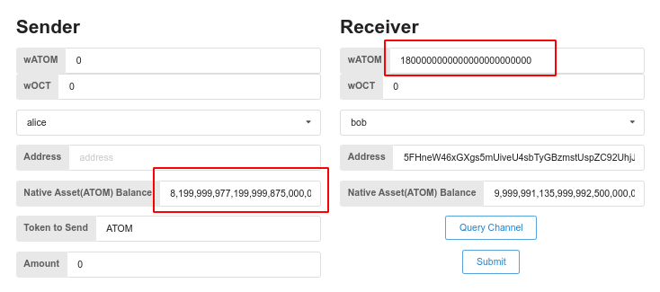

# Operation Guide

## Transfer tokens by CLI

* Launch 2 IBC enabled Substrate chains locally in 2 terminals
in terminal 1:
```bash
# in terminal 1:
git clone --branch feature/ics20-ibc-0 https://github.com/octopus-network/substrate.git substrate-ibc0

cd substrate-ibc0
# git reset --hard 9cccbd72bf6e276557d4512e720e9f51ea9e63ce
git submodule update --init
git pull
rm bin/node-template/octopus-pallets/Cargo.toml
rm -rf .ibc-*
cargo build -p node-template 

# build and lanch a chain to be recognized as ibc-0 by the relayer
RUST_BACKTRACE=full RUST_LOG="runtime::pallet-ibc=trace,ibc-rs=trace" ./target/debug/node-template --dev -d .ibc-0 --rpc-methods=unsafe --ws-external --enable-offchain-indexing true
```

in terminal 2:
```bash
# in terminal 2:
git clone --branch feature/ics20-ibc-1 https://github.com/octopus-network/substrate.git substrate-ibc1

cd substrate-ibc1
git reset --hard 23d5504a843abd5d91232a3878fd790059adf884
git submodule update --init
git pull
rm bin/node-template/octopus-pallets/Cargo.toml
rm -rf .ibc-*
cargo build -p node-template 

# build and lanch a chain to be recognized as ibc-1 by the relayer
RUST_BACKTRACE=full RUST_LOG="runtime::pallet-ibc=trace,ibc-rs=trace" ./target/debug/node-template --dev -d .ibc-1 --rpc-methods=unsafe --ws-external --enable-offchain-indexing true  --port 2033 --ws-port 8844
```

* (Option)explore the chains info and events via polkadot.js:   
    https://polkadot.js.org/apps/?rpc=ws%3A%2F%2F127.0.0.1%3A9944#/explorer  
    https://polkadot.js.org/apps/?rpc=ws%3A%2F%2F127.0.0.1%3A8844#/explorer

* Create IBC channel in terminal 3
```bash
git clone --branch feature/ics20 https://github.com/octopus-network/ibc-rs.git
cd ibc-rs
cargo build
# import substrate account
./target/debug/hermes -c config.toml keys add ibc-0 -f ./david_seed.json
./target/debug/hermes -c config.toml keys add ibc-1 -f ./davirain_seed.json

# create channel
RUST_BACKTRACE=full  ./target/debug/hermes -c config.toml  create channel --port-a transfer --port-b transfer ibc-0 -c ibc-1 -o unordered --new-client-connection
```

* Start mmr root update service in terminal 4
```bash
git clone --branch feature/v0.9.13 https://github.com/octopus-network/octopusxt.git
cd octopusxt
sleep 10;cargo test test_update_client_state_service -- --nocapture 
```

* Create asset wATOM on ibc-1
- visit https://polkadot.js.org/apps/?rpc=ws%3A%2F%2F127.0.0.1%3A8844#/sudo 
- press F5 to refresh the webpage(overcome the bug of polkadot.js)
- create asset as the capture below


* Start relaying in terminal 3
```bash
# wait for the channel to be created and start relaying packets for the 2 Substrate chains
RUST_BACKTRACE=full ./target/debug/hermes -c config.toml start
```

* Transfer fungible tokens in ternimal 5(CLI)
```bash
git clone --branch feature/v0.9.13 https://github.com/octopus-network/octopusxt.git
cd octopusxt
# alice in Substrate chain ibc-0 transfer 2000000000000000000000000 ATOM to bob in Substrate chain ibc-1
cargo run -- ibc-transfer ws://localhost:9944  alice bob ATOM transfer channel-0 2000000000000000000000000 99999 9999999999999999999
# bob in Substrate chain ibc-1 redeem ATOM back to alice in Substrate chain ibc-0
cargo run -- ibc-transfer ws://localhost:8844 bob alice ibc/04C1A8B4EC211C89630916F8424F16DC9611148A5F300C122464CE8E996AABD0 transfer channel-0 300000000000000000000000 9999 9999999999999999999
```

* Verify events in polkadot.js
- Verify send packet event of chain ibc-0 in https://polkadot.js.org/apps/?rpc=ws%3A%2F%2F127.0.0.1%3A9944#/explorer


- Verify send packet event of chain ibc-0 in https://polkadot.js.org/apps/?rpc=ws%3A%2F%2F127.0.0.1%3A8844#/explorer


* Verify balance in demo front-end in terminal 6
```bash
git clone https://github.com/octopus-network/ibc-frontend-demo.git
cd ibc-frontend-demo
yarn install
yarn start
```
Visit http://localhost:8000/octopus-network/ibc-frontend-demo and verifying balance as the capture below




* Transfer fungible tokens on browser
Visit http://localhost:8000/octopus-network/ibc-frontend-demo and refer to the instructions in the video

## Video Demo
  Pls refer to [Youtube](https://www.youtube.com/watch?v=pKcrPYAhPto)
## Issues
  N/A